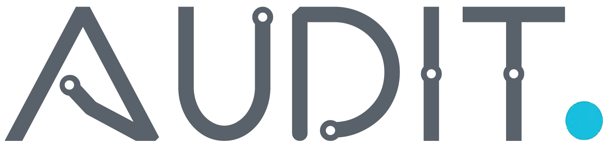

   

-----------------

# Audit

Audit it's a digital platform with the objective of facilitating user interaction with bid supervision, providing with transparency all the necessary data to evaluate and report on corruption/fraud.

This solution won first place in [Hackribeirão 2019](https://www.facebook.com/events/359468258280020/).

## Author

- [Alison Franclin](https://www.linkedin.com/in/alissonfranclin/)  
- [Gabriel Pestrini](https://github.com/pestrini)  
- [Maria Costa](https://www.linkedin.com/in/mariatheresanc/)  
- [Tomaz Macedo](https://github.com/tomazalexandre)  
- [Wesley Mendes](https://github.com/WesGtoX)  

## License

[MIT](LICENSE)